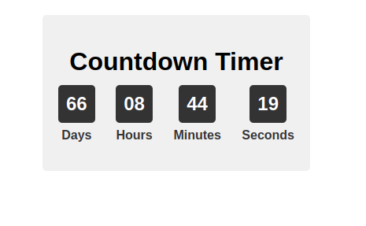

# Contador-Regressivo
Um contador regressivo simples e personalizável criado com HTML, CSS e JavaScript.



## Recursos

- Defina uma data e hora-alvo para o seu contador regressivo.
- O contador exibe dias, horas, minutos e segundos.
- Personalize a aparência usando CSS.
- Atualização automática a cada segundo.

## Uso

1. Clone este repositório para sua máquina local:

    ```
    git clone https://github.com/jossias/contador-regressivo.git
    ```

2. Abra o arquivo `index.html` em seu navegador da web para visualizar o contador regressivo.

3. Personalize a data e hora-alvo no arquivo `script.js` para definir o seu contador regressivo desejado.

4. Modifique o CSS no arquivo `styles.css` para alterar a aparência do contador.

## Exemplo

No código fornecido, a data e hora-alvo estão definidas para 31 de dezembro de 2023, à meia-noite. Você pode alterar essa data, modificando a seguinte linha no arquivo `script.js`:

```javascript
const targetDate = new Date("2023-12-31 00:00:00").getTime();
```

Este projecto foi criado como um exercício de aprendizado para trabalhar com funções de data e hora em JavaScript.

Se você tiver alguma sugestão ou melhoria, por favor, abra uma issue ou um pull request.
